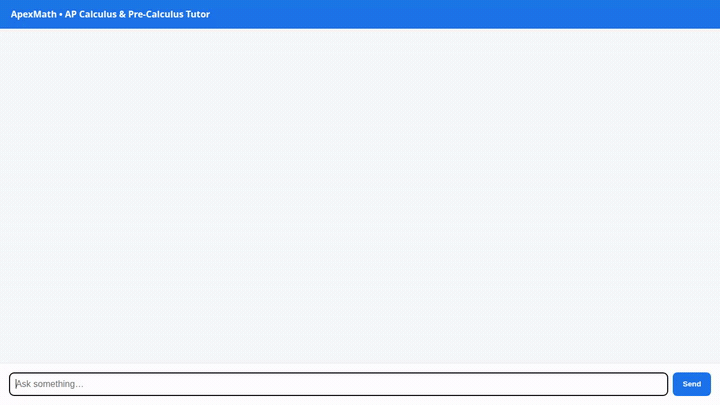

<div align="center">

# 📐 ApexMath

### Intelligent Pre-Calculus & AP Calculus Tutor on Google Cloud Agent Platform

An agentic math tutor that delivers targeted curriculum problems, provides progressive hint scaffolding, calculates symbolic derivatives and integrals, visualizes geometric concepts, and tracks student mastery over time with cross-session memory.

<br/>



<br/>


</div>

---

## 📖 Overview

**ApexMath** is an AI tutor specifically engineered for high school Pre-Calculus and AP Calculus (AB and BC) students. Rather than merely presenting solutions, ApexMath acts as an interactive tutor:

1. **Curriculum Problem Retrieval**: Fetches structured exercises across Limits, Derivatives, Integrals, Series, and Trigonometry.
2. **Progressive Hint Scaffolding**: Delivers graduated clues and conceptual pointers before revealing full step-by-step solutions.
3. **Symbolic Math Verification**: Accurately computes derivatives, integrals, tangent line equations, roots, and factors.
4. **Multimodal Concept Diagrams**: Dynamically creates geometric diagrams (such as the Unit Circle and Riemann Sum approximations) and uploads them to Google Cloud Storage.
5. **Student Mastery Tracking**: Records student attempts, scores, and common mistakes in Cloud Firestore to compute accuracy metrics and recommend focus topics.
6. **Cross-Session Long-Term Memory**: Automatically persists student struggles, questions, and progress across conversations using Vertex AI Memory Bank.
7. **Rich A2UI Presentation**: Renders problems, hints, scorecards, and diagrams in structured A2UI cards instead of plain text.

---

## ☁️ Google Cloud Services & Architecture

ApexMath is built on the Google Cloud Agent Platform using the Agent Development Kit (ADK) and deployed to Agent Runtime:

```
[ User Browser ]
       │
       ▼ (HTTP / Web UI)
[ FastAPI Proxy (Cloud Run / Local) ]
       │
       ▼ (A2A Protocol / JSON-RPC)
[ Agent Runtime (Reasoning Engine) ]
   ├── Agent Core: Gemini 3.6 Flash + ADK
   ├── UI System: A2UI 0.8 Schema Manager & Catalog
   ├── Memory: Vertex AI Memory Bank (Agent Engine)
   ├── Database: Cloud Firestore (Problems & Attempts)
   ├── Visual Assets: Google Cloud Storage (Diagram Bucket)
   └── Multimodal Gen: Gemini 3.1 Flash Lite Image
```

### Wired Google Cloud Services

| Service | Role in ApexMath | Implementation Details |
| :--- | :--- | :--- |
| **Vertex AI Memory Bank** | Long-Term Cross-Session Memory | Preloads student historical context via `PreloadMemoryTool` and asynchronously sends session transcripts to Agent Engine for automated memory extraction via `add_session_to_memory()` callback. |
| **Cloud Firestore** | Problem Catalog & Attempt Logs | Stores curriculum problem banks (`practice_problems`) and tracks student submissions, correctness, points, and coaching feedback (`student_attempts`). |
| **Google Cloud Storage** | Diagram & Visual Asset Hosting | Stores generated mathematical diagrams and plots in a dedicated bucket (`gs://apexmath-visuals-...`) with public HTTPS URLs for display in the frontend. |
| **Gemini 3.1 Flash Lite Image** | Multimodal Diagram Generation | Dynamically generates geometric diagrams (e.g. Unit Circle with radian coordinates, Riemann sums) via `google.genai.Client` and saves them to Cloud Storage. |
| **A2UI 0.8** | Agent-to-User Interface Cards | Builds system prompts with `A2uiSchemaManager` and emits structured JSON `DataPart` components (Cards, Columns, Texts, and Images) converted via `a2ui_callback`. |
| **Agent Engine Code Sandbox** | Sandbox Environment | Integrated code executor for running computational sandboxes. |

---

## 🛠️ Tools Implemented in `app/`

The agent in [`app/agent.py`](app/agent.py) implements and wires the following tools:

- `get_practice_problems`: Queries Cloud Firestore for practice exercises filtered by topic (Limits, Derivatives, Integrals, Trigonometry, etc.), course level, or difficulty.
- `get_problem_details`: Fetches progressive hints, step-by-step solutions, or AP exam grading rubrics for a specific problem ID.
- `record_student_attempt`: Records student answers, score (points), correctness flag, and tutoring feedback directly into Cloud Firestore.
- `get_student_scorecard`: Aggregates Firestore attempt logs to return total attempts, overall accuracy percentage, topic breakdown, and recommended weak areas.
- `calculate_symbolic_math`: Computes exact symbolic calculus and algebra operations (`derive`, `integrate`, `tangent`, `zeroes`, `simplify`, `factor`) via mathematical web APIs.
- `generate_concept_diagram`: Generates conceptual figures and geometric diagrams using `gemini-3.1-flash-lite-image` and uploads them to Google Cloud Storage.
- `plot_function`: Generates 2D curve and tangent line plots, saving them to Cloud Storage.
- `add_practice_problem`: Allows instructors or administrators to seed new practice questions into the Firestore catalog.
- `PreloadMemoryTool`: Injects past memories and learning profiles into the conversation prompt.

### 📌 Feature Status Note
- **Planned / Not Yet Implemented**: Custom SymPy script execution inside the sandbox for automated multi-step algebraic proof validation was outlined in the initial concept brief and is planned for a future update; currently, symbolic mathematical steps are verified via the integrated math API and Python functions.

---

## 💻 Local Setup & Development

### Prerequisites
- Python 3.12 or 3.13
- [`uv`](https://docs.astral.sh/uv/) package manager
- [Google Cloud CLI (`gcloud`)](https://cloud.google.com/sdk/docs/install) authenticated with Application Default Credentials (`gcloud auth application-default login`)

### 1. Clone & Install Dependencies

```bash
git clone <your-repo-url>
cd apexmath

# Install agent dependencies
uv pip install -r pyproject.toml
```

### 2. Configure Environment

Copy the example environment file and configure your Google Cloud project details:

```bash
cp .env.example .env
```

Ensure the following variables are set in `.env`:
```ini
GOOGLE_CLOUD_PROJECT="your-project-id"
FIRESTORE_PROJECT="your-project-id"
STORAGE_BUCKET_NAME="your-storage-bucket-name"
```

### 3. Run the Agent Locally

Start the local Agent Playground with Vertex AI Memory Bank connected:

```bash
uv run adk web . --port 8080 --reload_agents --memory_service_uri=agentengine://<AGENT_ENGINE_ID>
```

### 4. Run the Chat Frontend Locally

The lightweight chat interface and FastAPI proxy live in `frontend/`:

```bash
cd frontend
python3 -m venv .venv
source .venv/bin/activate
pip install -r requirements.txt

# Point to your deployed Agent Engine resource or local server
export AGENT_ENGINE_RESOURCE_NAME="projects/<PROJECT_NUMBER>/locations/us-east1/reasoningEngines/<ENGINE_ID>"
export AGENT_DIRECTORY="app"
export PORT=8080

python main.py
```

### 5. Running Tests

Execute unit and integration tests:

```bash
uv run pytest tests/unit tests/integration
```

---

## 📂 Project Structure

```
apexmath/
├── app/
│   ├── __init__.py
│   ├── agent.py                 # Core ADK agent configuration & tools
│   ├── a2ui_utils.py            # A2UI after_model_callback handler
│   ├── firestore_tools.py       # Firestore problem bank & student tracking
│   ├── diagram_image_tools.py   # Gemini Flash Lite Image diagram generator
│   ├── graphing_tools.py        # Function graphing and visual tools
│   ├── math_api_tools.py        # Symbolic math calculation tools
│   └── fast_api_app.py          # FastAPI application server
├── frontend/
│   ├── main.py                  # A2A client proxy for Agent Engine
│   ├── Dockerfile               # Container build for Cloud Run deployment
│   ├── requirements.txt         # Frontend dependencies
│   └── static/
│       └── index.html           # Lightweight chat UI with native A2UI renderer
├── assets/
│   └── demo.gif                 # Demo video recording
├── tests/                       # Unit and integration test suites
├── agents-cli-manifest.yaml     # Agents CLI project configuration
└── pyproject.toml               # Project dependencies and packaging
```

---

## 📄 License

This project is licensed under the Apache License 2.0.
